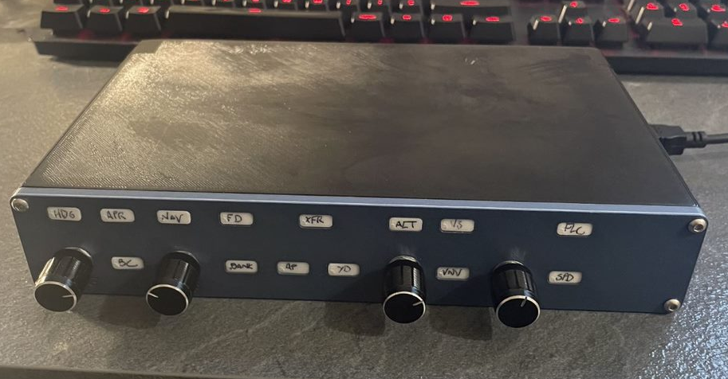

# autopilot_msfs
Project files for the MSFS autopilot box I built.

The PrusaPrinters.org link is [here](https://www.prusaprinters.org/prints/117963-autopilot-box-for-msfs).

# What is where?
- the Images folder contains some pictures of the project, including some taken during the build
- the Printable Parts folder contains the STL files for the printable components, as well as my GCODE for the Prusa MK3S
- the Project files folder contains the Autodesk Fusion 360 project file and the Fritzing project file
- the Mobiflight folder contains both the mapping and Arduino configuration for Mobiflight and MSFS, using SimConnect
- schematics_bb.png is the simulated breadboard from Fritzing
- schematics_bom.pdf is the Bill of Materials for electronics
- schematics_schem.pdf is the export of the circuit diagram

# DISCLAIMER

I am by no means an expert in 3d printing, modelling and/or electronics.
This repository is provided for convenience, and no guarantees of fitness of use are made or implied. You use these files and build the project at your own risk.